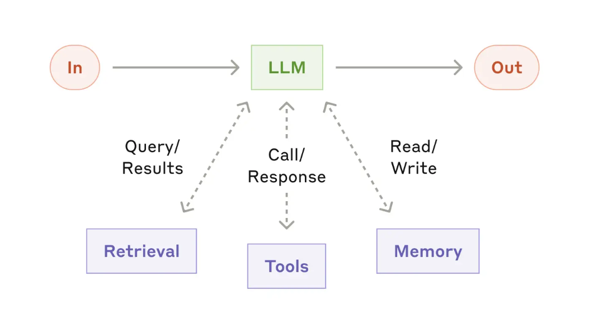
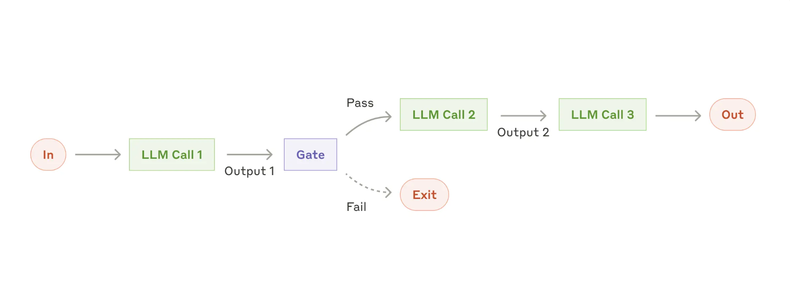

## What are agents?
"Agent" can be defined in several ways. Some define agents as fully autonomous systems that operate independently over extended periods, using various tools to accomplish complex tasks. Others use the term to describe more prescriptive implementations that follow predefined workflows. At Anthropic, they categorize all these variations as agentic systems, but draw an important architectural distinction between workflows and agents:

- **Workflows** are systems where LLMs and tools are orchestrated through predefined code paths.
- **Agents**, on the other hand, are systems where LLMs dynamically direct their own processes and tool usage, maintaining control over how they accomplish tasks.

Below, we will explore both types of agentic systems in detail.

## When (and when not) to use agents
When building applications with LLMs, we recommend finding the simplest solution possible, and only increasing complexity when needed. This might mean not building agentic systems at all. Agentic systems often trade latency and cost for better task performance, and you should consider when this tradeoff makes sense.

When more complexity is warranted, workflows offer predictability and consistency for well-defined tasks, whereas agents are the better option when flexibility and model-driven decision-making are needed at scale. For many applications, however, optimizing single LLM calls with retrieval and in-context examples is usually enough.

## When and how to use frameworks
There are many frameworks that make agentic systems easier to implement, including: LangGraph from LangChain, Autogen from Microswoft, and LlamaIndex, etc.

These frameworks make it easy to get started by simplifying standard low-level tasks like calling LLMs, defining and parsing tools, and chaining calls together. However, they often create extra layers of abstraction that can obscure the underlying prompts ​​and responses, making them harder to debug. They can also make it tempting to add complexity when a simpler setup would suffice.

We suggest that developers start by using LLM APIs directly: many patterns can be implemented in a few lines of code. If you do use a framework, ensure you understand the underlying code. Incorrect assumptions about what's under the hood are a common source of customer error.

## Building blocks, workflows, and agents

### Building block: The augmented LLM

### Workflow: Prompt chaining

### Workflow: Routing

### Workflow: Parallelization

### Workflow: Orchestrator-workers 

### Workflow: Evaluator-optimizer 

## Agents 
Agents are typically just LLMs using tools based on environmental feedback in a loop. 

[via](https://www.anthropic.com/research/building-effective-agents)