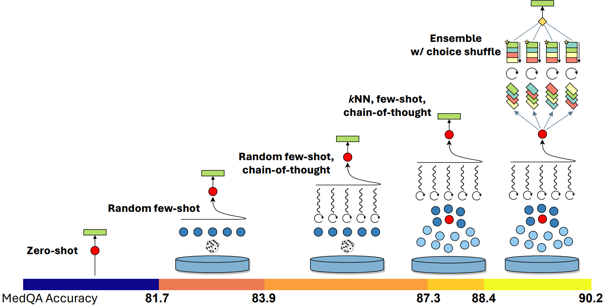
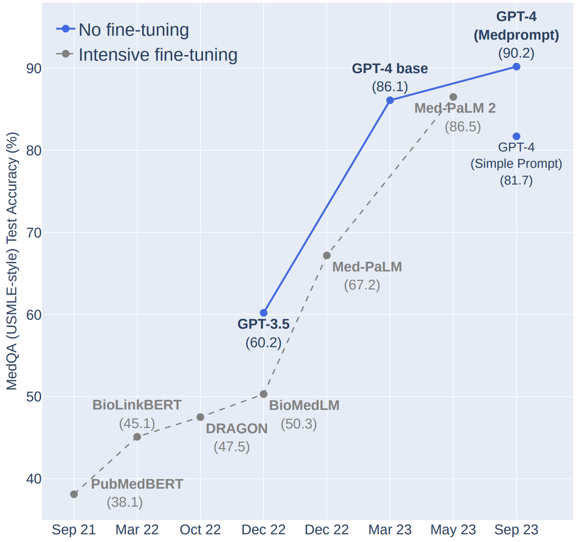
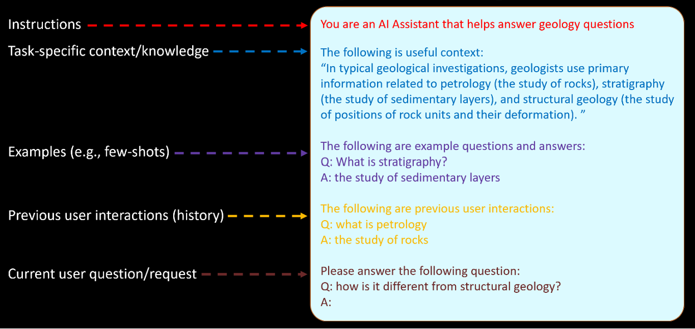
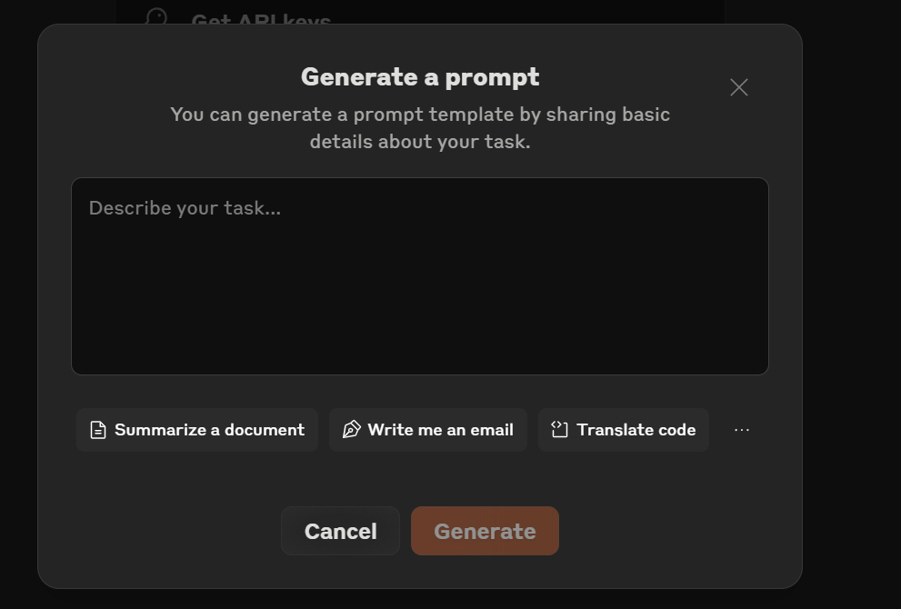
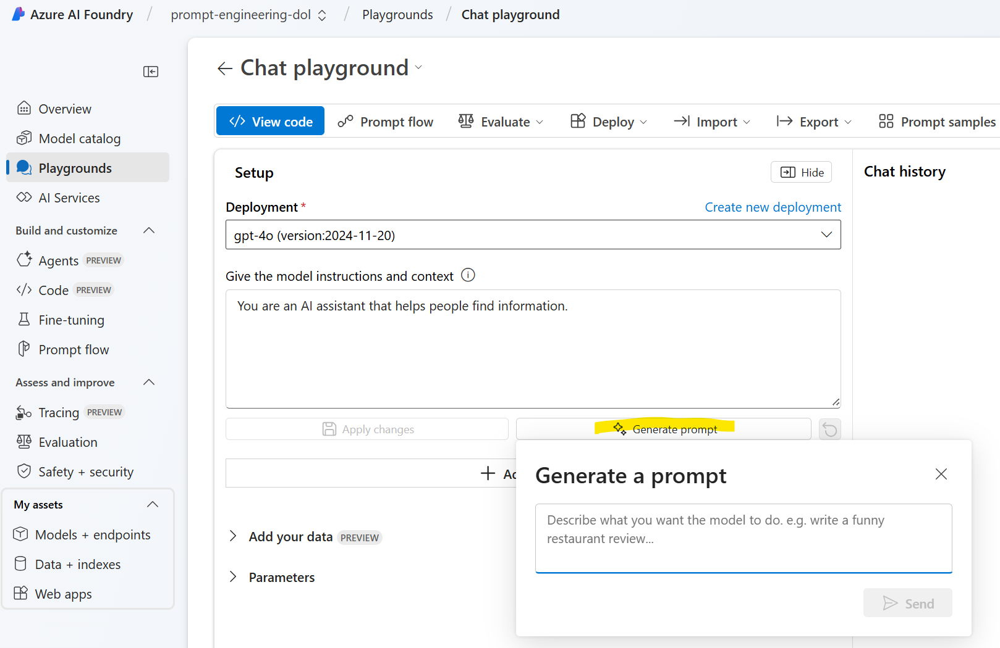
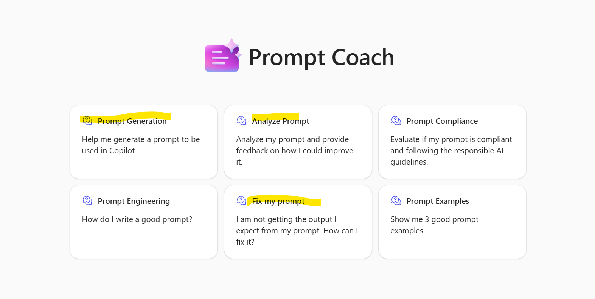
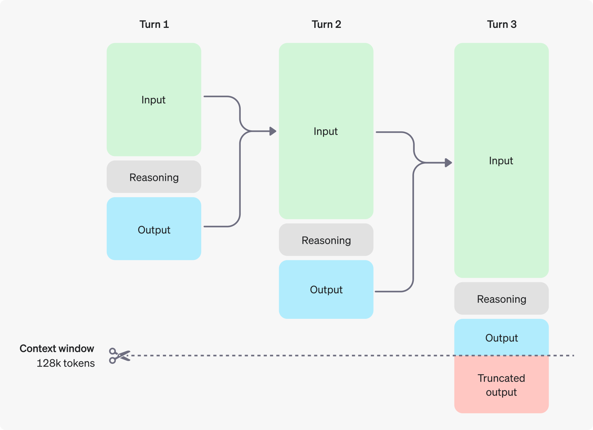
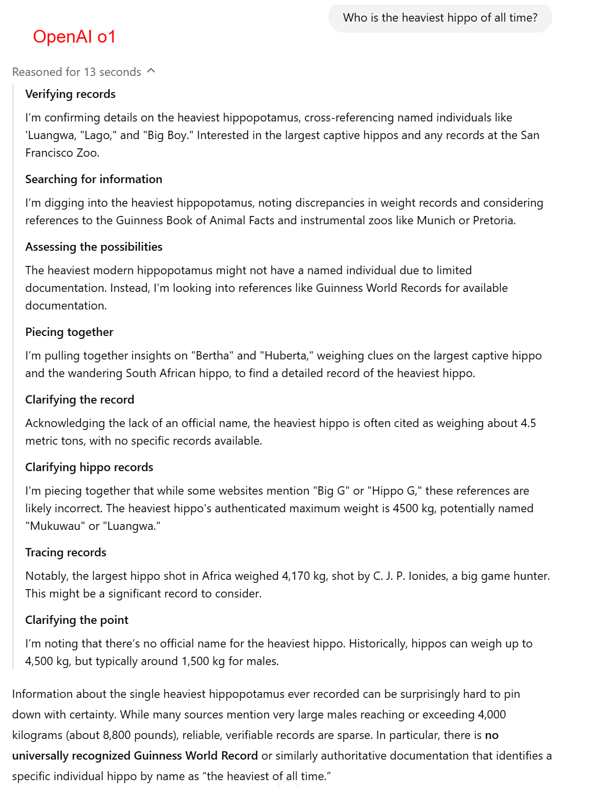

## Content
- [What is prompt engineering?](#what-is-prompt-engineering)
- [Why prompt engineering matters?](#why-prompt-engineering-matters)
- [Basics of prompt engineering](#basics-of-prompt-engineering)
- [The prompt engineering lifecycle](#the-prompt-engineering-lifecycle)
- [Inference Parameters](#inference-parameters)
- [Zero-Shot](#zero-shot)
- [Few-Shot](#few-shot)
- [Chain of thought](#chain-of-thought)
- [Self-Consistency](#self-consistency)
- [General Tips for Designing Prompts](#general-tips-for-designing-prompts)
- [Common Misconceptions About Prompts](#common-misconceptions-about-prompts)
- [Prompt Generator Tools](#prompt-generator-tools)
- [Reasoning Model (i.e. OpenAI o1/DeepSeek R1)](#reasoning-model-ie-openai-o1deepseek-r1)

# What is prompt engineering?
Prompt engineering is about "communicating" with LLM in a way that maximizes the model's understanding and performance on a given task. At its core, prompt engineering involves designing, refining, and optimizing the text inputs (prompts) given to models to elicit accurate, relevant, and useful responses.
<!-- more -->
# [Why prompt engineering matters?](https://www.microsoft.com/en-us/research/blog/the-power-of-prompting/)

* **Enhancing AI capabilities:** Well-engineered prompts can dramatically improve an AI's performance, enabling it to tackle complex tasks with greater accuracy and efficiency.
* **Bridging the gap between human intent and AI output:** Prompt engineering helps translate human objectives into language that AI models can effectively interpret and act upon.
* **Optimizing resource usage:** Skilled prompt engineering can reduce token usage, lowering costs and improving response times in production environments.

Let's look at two examples that demonstrate how prompt engineering can significantly enhance the performance of large language models (LLMs)

### 1. Medprompt ([a prompting technique from a study by Microsoft](https://arxiv.org/pdf/2311.16452)) enhances the performance of GPT-4: 
MedPrompt is composed of the following prompting techniques:  

- Dynamic few-shot selection: instead of using static few-shot examples, Medprompt selects few-shot examples dynamically based on the question.  
- Self-generated chain of thought.  
- Choice shuffle ensembling: performs choice shuffle and self-consistency prompting.  

> We will explore Few-Shot, Chain of Thought, and Self-Consistency in the following sections.


<p align="center"><em>Response accuracy increases significantly when applying more advanced prompt engineering techniques.</em></p>


#### MedPrompt allows GPT-4 to compete with fine-tuned models. (GPT-4 vs Fine-tuning)
 - While fine-tuning can boost performance, the process can be expensive. Fine-tuning often requires experts or professionally labeled datasets (e.g., via top clinicians in the MedPaLM project) and then computing model parameter updates. The process can be resource-intensive and cost-prohibitive, making the approach a difficult challenge for many small and medium-sized organizations. 


<p align="center"><em>The Medprompt shows GPT-4’s ability to compete a leading model that was fine-tuned specifically for medical applications, on the same benchmarks and by a significant margin.</em></p>

### 2. Boosting Lower-Tier Models with Effective Prompting. (GPT-3.5 vs GPT-4)
By wraping in an **iterative agent workflow**, GPT-3.5 achieves up to 95.1% of GPT-4 on tasks, like, content summarization and translation. For example, we can ask the LLM to iterate over a document many times: (from [Andrew Ng's post](https://www.deeplearning.ai/the-batch/how-agents-can-improve-llm-performance/?ref=dl-staging-website.ghost.io) & - [What's next for AI agentic workflows ft. Andrew Ng of AI Fund - 2024](https://www.youtube.com/watch?v=sal78ACtGTc)
) 

- Plan an outline.
- Write a first draft.
- Read over the first draft to spot unjustified arguments or extraneous information.
- Revise the draft taking into account any weaknesses spotted.

#### You may ask, why not always use the most advanced models?
- Cost: The advanced models are more expensive to run.
- Speed: The advanced models are slower to generate responses.
- Availability: The advanced models might not be available in certain scenarios—for example, on edge devices. 

## Basics of prompt engineering
A prompt contains any of the following elements:​

- **Instruction:** a specific task or instruction you want the model to perform​.
- **Context:** external information or additional context that can steer the model to better responses​.
- **Input Data:** the input or question that we are interested to find a response for​.
- **Output Indicator:** the type or format of the output.​

You do not need all the four elements for a prompt and the format depends on the task at hand. We will touch on more concrete examples in upcoming guides.​



## The prompt engineering lifecycle
It would be nice to sit down at a blank page and craft the perfect prompt on the first try, but the reality is that **prompt engineering is an iterative process that involves creating, testing, and refining prompts to achieve optimal performance.**


Understanding this lifecycle is crucial for developing effective prompts and troubleshooting issues that arise. 

1. Initial prompt creation 
2. Testing and identifying issues
3. Selecting appropriate techniques
4. Implementing improvements
5. Iterating and refining


## [Inference Parameters](https://learn.microsoft.com/en-us/azure/ai-services/openai/reference#request-body)
Inference parameters are used to control the behavior of the model during inference. There are more inference parameters, we only cover the most common ones here.  

- **System prompt:** A system prompt is a way to **provide role playing, context, instructions, and few-shot to LLM**, while putting a question or task in the "User" turn. 
    - **Higher priority:** System messages define the primary behavior and are less likely to be overridden by a later user message.
    - **Consistency:** If your application always needs certain examples or guidelines, placing them in the system prompt ensures they remain in effect throughout the conversation.

- **Max tokens:** Set a limit on the number of tokens per model response. 
    - Set appropriate output limits. Use the max_tokens parameter to set a hard limit on the maximum length of the generated response. This prevents LLM from generating overly long outputs, which reduces latency.
    - Note: Some LLMs' (e.g. Phi) max tokens = input tokens + output tokens, please be aware. 
  >  One token is roughly 4 characters for typical English text.

- **Temperature:** Controls randomness. Lowering the temperature means that the model will produce more focused and deterministic responses. Increasing the temperature will result in more diverse and creative responses. Try adjusting temperature or Top P but not both.

- **Top P:** Similar to temperature, this controls randomness but uses a different method. Lowering Top P will narrow the model’s token selection to likelier tokens. Increasing Top P will let the model choose from tokens with both high and low likelihood. Try adjusting temperature or Top P but not both.

- **Frequency penalty:**  This decreases the likelihood of repeating the exact same text in a response.
    - OpenAI models' range: -2.0 to 2.0, default value is 0.

- **Presence penalty:** This increases the likelihood of introducing new topics in a response.
    - OpenAI models' range: -2.0 to 2.0, default value is 0.

- **Stop sequence:** Make the model end its response at a desired point. The model response will end before the specified sequence, so it won't contain the stop sequence text. For ChatGPT, using <|im_end|> ensures that the model response doesn't generate a follow-up user query. You can include as many as four stop sequences.

# Let's look at some of the most commonly used prompting techniques:

## Zero-Shot
Zero-shot is to simply feed the task text to the model and ask for results.
```
Text: i'll bet the video game is a lot more fun than the film.
Sentiment:
```

## Few-Shot
Hands-on notebook: [Few-Shot_Prompting.ipynb](https://github.com/AICrafterZheng/aicrafterzheng.github.io/blob/main/docs/posts/notebooks/1.Few-Shot_Prompting.ipynb)  

You might also encounter the phrase "n-shot" or "one-shot". The number of "shots" refers to how many examples are used within the prompt.

**Giving LLM examples of how you want it to behave (or how you want it not to behave) is extremely effective** for:

- Getting the right answer
- Getting the answer in the right format (e.g. JSON, HTML, etc.). 
    - Few-shot prompting is an effective way to obtain a JSON output when function calling or JSON mode is not supported by an LLM.


### For maximum effectiveness, make sure that your examples are:
- **Relevant:** Your examples mirror your actual use case.
- **Diverse:** Your examples cover edge cases and potential challenges, and vary enough that LLM doesn't inadvertently pick up on unintended patterns.
- **Clear:** Your examples are wrapped in <example> tags (if multiple, nested within <examples> tags) for structure.

No Examples:
```
Analyze this customer feedback and categorize the issues. Use these categories: UI/UX, Performance, Feature Request, Integration, Pricing, and Other. Also rate the sentiment (Positive/Neutral/Negative) and priority (High/Medium/Low).

Here is the feedback: {{FEEDBACK}}
```
With Examples:
```
Our CS team is overwhelmed with unstructured feedback. Your task is to analyze feedback and categorize issues for our product and engineering teams. Use these categories: UI/UX, Performance, Feature Request, Integration, Pricing, and Other. Also rate the sentiment (Positive/Neutral/Negative) and priority (High/Medium/Low). Here is an example:

<example>
Input: The new dashboard is a mess! It takes forever to load, and I can’t find the export button. Fix this ASAP!
Category: UI/UX, Performance
Sentiment: Negative
Priority: High
</example>

Now, analyze this feedback: {{FEEDBACK}}
```


## Chain of thought
Hands-on notebook: [Chain_of_Thought.ipynb](https://github.com/AICrafterZheng/aicrafterzheng.github.io/blob/main/docs/posts/notebooks/3.Chain_of_Thought.ipynb)  

Giving LLM space to think can dramatically improve its performance. This technique, known as chain of thought (CoT) prompting, encourages LLM to break down problems step-by-step, leading to more accurate and nuanced outputs.
​
#### Why let LLM think?
- **Accuracy:** Stepping through problems reduces errors, especially in math, logic, analysis, or generally complex tasks.
- **Coherence:** Structured thinking leads to more cohesive, well-organized responses.
- **Debugging:** Seeing LLM’s thought process helps you pinpoint where prompts may be unclear.
​
#### Why not let LLM think?
Increased output length may impact latency.
Not all tasks require in-depth thinking. Use CoT judiciously to ensure the right balance of performance and latency.
> Use CoT for tasks that a human would need to think through, like complex math, multi-step analysis, writing complex documents, or decisions with many factors.

#### How to prompt for thinking
> CoT tip: Always have LLM output its thinking. Without outputting its thought process, no thinking occurs!

- Basic prompt: Include “Think step-by-step” in your prompt.
    - Lacks guidance on how to think (which is especially not ideal if a task is very specific to your app, use case, or organization)
    ```
    Draft personalized emails to donors asking for contributions to this year’s Care for Kids program.

    Program information:
    <program>{{PROGRAM_DETAILS}}
    </program>

    Donor information:
    <donor>{{DONOR_DETAILS}}
    </donor>

    Think step-by-step before you write the email.
    ```
- Guided prompt: Outline specific steps for LLM to follow in its thinking process.
    - Lacks structuring to make it easy to strip out and separate the answer from the thinking.
    ```
    Draft personalized emails to donors asking for contributions to this year’s Care for Kids program.

    Program information:
    <program>{{PROGRAM_DETAILS}}
    </program>

    Donor information:
    <donor>{{DONOR_DETAILS}}
    </donor>

    Think before you write the email. First, think through what messaging might appeal to this donor given their donation history and which campaigns they’ve supported in the past. Then, think through what aspects of the Care for Kids program would appeal to them, given their history. Finally, write the personalized donor email using your analysis.
    ```
- Structured prompt: Use XML tags like <thinking> and <answer> to separate reasoning from the final answer.
    ```
    Draft personalized emails to donors asking for contributions to this year’s Care for Kids program.

    Program information:
    <program>{{PROGRAM_DETAILS}}
    </program>

    Donor information:
    <donor>{{DONOR_DETAILS}}
    </donor>

    Think before you write the email in <thinking> tags. First, think through what messaging might appeal to this donor given their donation history and which campaigns they’ve supported in the past. Then, think through what aspects of the Care for Kids program would appeal to them, given their history. Finally, write the personalized donor email in <email> tags, using your analysis.
    ```
> Use code (e.g. extract from `<answer>` tags) to extract the desired answer from the LLM's response

## Self-Consistency

Proposed by [Wang et al. (2022)](https://arxiv.org/abs/2203.11171), self-consistency aims "to replace the naive greedy decoding used in chain-of-thought prompting". The idea is to sample multiple, diverse reasoning paths through few-shot CoT, and use the generations to select the most consistent answer. This helps to boost the performance of CoT prompting on tasks involving arithmetic and commonsense reasoning.

## More [prompting techiques](https://www.promptingguide.ai/techniques/tot) if you are interested.

- [Tree of Thought](https://www.promptingguide.ai/techniques/tot)
- [ReAct](https://www.promptingguide.ai/techniques/react)
- [Reflexion](https://www.promptingguide.ai/techniques/reflexion)
- ...

# General Tips for Designing Prompts
Okey, we have covered the basics of prompt engineering. Now, let's dive into some general tips for designing prompts.
### 1. Start Simple: ([source](https://help.openai.com/en/articles/6654000-best-practices-for-prompt-engineering-with-the-openai-api))
   - As you get started with designing prompts, you should keep in mind that it is really an iterative process that requires a lot of experimentation to get optimal results. Using a simple playground, for example, Azure AI Foundry is a good starting point.


### 2. Be clear, direct, and detailed: ([source](https://help.openai.com/en/articles/6654000-best-practices-for-prompt-engineering-with-the-openai-api))
Think of LLM like any other human that is new to the job. **LLM has no context** on what to do aside from what you literally tell it. Just as when you instruct a human for the first time on a task, the more you explain exactly what you want in a straightforward manner to LLM, the better and more accurate LLM's response will be."

#### When in doubt, follow the **Golden Rule of Clear Prompting**: 
- Show your prompt to a colleague or friend and have them follow the instructions themselves to see if they can produce the result you want. If they're confused, LLM's confused.	

#### How to be clear, contextual, and specific:
  - What the task results will be used for
  - What audience the output is meant for
  - What workflow the task is a part of, and where this task belongs in that workflow
  - The end goal of the task, or what a successful task completion looks like
- Be specific about what you want LLM to do:  
For example, if you want LLM to output only code and nothing else, say so.
- Provide instructions as sequential steps:  
Use numbered lists or bullet points to better ensure that LLM carries out the task the exact way you want it to.

#### Unclear Prompt 
```
Please remove all personally identifiable information from these customer feedback messages: {{FEEDBACK_DATA}}
```

#### Clear Prompt
```
Your task is to anonymize customer feedback for our quarterly review.

Instructions:
1. Replace all customer names with “CUSTOMER_[ID]” (e.g., “Jane Doe” → “CUSTOMER_001”).
2. Replace email addresses with “EMAIL_[ID]@example.com”.
3. Redact phone numbers as “PHONE_[ID]“.
4. If a message mentions a specific product (e.g., “AcmeCloud”), leave it intact.
5. If no PII is found, copy the message verbatim.
6. Output only the processed messages, separated by ”---”.

Data to process: {{FEEDBACK_DATA}}
```

### 3. Giving LLM a role with a system prompt: ([source](https://help.openai.com/en/articles/6654000-best-practices-for-prompt-engineering-with-the-openai-api))
- **Enhanced accuracy:** In complex scenarios like legal analysis or financial modeling, role prompting can significantly boost LLM’s performance.
- **Tailored tone:** Whether you need a CFO’s brevity or a copywriter’s flair, role prompting adjusts LLM’s communication style.
- **Improved focus:** By setting the role context, LLM stays more within the bounds of your task’s specific requirements.
>Role prompting tip: Experiment with roles! A data scientist might see different insights than a marketing strategist for the same data. A data scientist specializing in customer insight analysis for Fortune 500 companies might yield different results still!

#### Financial analysis without role prompting. 
```
Analyze this dataset of our Q2 financials:
<data>
{{FINANCIALS}}
</data>

Highlight key trends and recommend actions.
```

#### Financial analysis with role prompting. 
```
You are the CFO of a high-growth B2B SaaS company. We’re in a board meeting discussing our Q2 financials:
<data>
{{FINANCIALS}}
</data>

Analyze key trends, flag concerns, and recommend strategic actions. Our investors want aggressive growth but are wary of our burn rate.
```

### 4. Put instructions at the beginning of the prompt and use delimiters like, `###` or `"""`,  or XML tags to separate the instruction and context. ([source](https://help.openai.com/en/articles/6654000-best-practices-for-prompt-engineering-with-the-openai-api))

### 5. Be specific, descriptive and as detailed as possible about the desired context, outcome, length, format, style, etc.  ([source](https://help.openai.com/en/articles/6654000-best-practices-for-prompt-engineering-with-the-openai-api))
Be specific about the context, outcome, length, format, style, etc.

Less effective ❌:
```
Write a poem about OpenAI. 
```

Better ✅:
```
Write a short inspiring poem about OpenAI, focusing on the recent DALL-E product launch (DALL-E is a text to image ML model) in the style of a {famous poet}
```

### 6. Reduce “fluffy” and imprecise descriptions: ([source](https://help.openai.com/en/articles/6654000-best-practices-for-prompt-engineering-with-the-openai-api))

Less effective ❌:
```
The description for this product should be fairly short, a few sentences only, and not too much more.
```

Better ✅:
```
Use a 3 to 5 sentence paragraph to describe this product.
```


### 7. Instead of just saying what not to do, say what to do instead: ([source](https://help.openai.com/en/articles/6654000-best-practices-for-prompt-engineering-with-the-openai-api))

Less effective ❌:
```
The following is a conversation between an Agent and a Customer. DO NOT ASK USERNAME OR PASSWORD. DO NOT REPEAT.

Customer: I can’t log in to my account.
Agent:
```

Better ✅:
```
The following is a conversation between an Agent and a Customer. The agent will attempt to diagnose the problem and suggest a solution, whilst refraining from asking any questions related to PII. Instead of asking for PII, such as username or password, refer the user to the help article www.samplewebsite.com/help/faq

Customer: I can’t log in to my account.
Agent:
```

### 8. Code Generation Specific - Use “leading words” to nudge the model toward a particular pattern: ([source](https://help.openai.com/en/articles/6654000-best-practices-for-prompt-engineering-with-the-openai-api))

Less effective ❌:
```
# Write a simple python function that
# 1. Ask me for a number in mile
# 2. It converts miles to kilometers
```

In this code example below, adding “import” hints to the model that it should start writing in Python. (Similarly “SELECT” is a good hint for the start of a SQL statement.) 

Better ✅:
```
# Write a simple python function that
# 1. Ask me for a number in mile
# 2. It converts miles to kilometers
 
import
```

### 9. Use prompt templates 
You should always use prompt templates and variables when you expect any part of your prompt to be repeated in another call to LLM. 
Prompt templates offer several benefits:

- Consistency: Ensure a consistent structure for your prompts across multiple interactions
- Efficiency: Easily swap out variable content without rewriting the entire prompt
- Testability: Quickly test different inputs and edge cases by changing only the variable portion
- Scalability: Simplify prompt management as your application grows in complexity
- Version control: Easily track changes to your prompt structure over time by keeping tabs only on the core part of your prompt, separate from dynamic inputs

```
Translate this text from English to Spanish: {{text}}
```


### 10. Long context prompting tips
- **Put longform data at the top:** Place your long documents and inputs (~20K+ tokens) near the top of your prompt, above your query, instructions, and examples. This can significantly improve LLM's performance.

> Queries at the end can improve response quality by up to 30% in tests, especially with complex, multi-document inputs.

- **Structure document content and metadata with XML tags:** When using multiple documents, wrap each document in <document> tags with <document_content> and <source> (and other metadata) subtags for clarity.
```xml
<documents>
  <document index="1">
    <source>annual_report_2023.pdf</source>
    <document_content>
      {{ANNUAL_REPORT}}
    </document_content>
  </document>
  <document index="2">
    <source>competitor_analysis_q2.xlsx</source>
    <document_content>
      {{COMPETITOR_ANALYSIS}}
    </document_content>
  </document>
</documents>

Analyze the annual report and competitor analysis. Identify strategic advantages and recommend Q3 focus areas.
```

- **Ground responses in quotes:** For long document tasks, ask LLM to quote relevant parts of the documents first before carrying out its task. This helps LLM cut through the “noise” of the rest of the document’s contents.
```xml
You are an AI physician's assistant. Your task is to help doctors diagnose possible patient illnesses.

<documents>
  <document index="1">
    <source>patient_symptoms.txt</source>
    <document_content>
      {{PATIENT_SYMPTOMS}}
    </document_content>
  </document>
  <document index="2">
    <source>patient_records.txt</source>
    <document_content>
      {{PATIENT_RECORDS}}
    </document_content>
  </document>
  <document index="3">
    <source>patient01_appt_history.txt</source>
    <document_content>
      {{PATIENT01_APPOINTMENT_HISTORY}}
    </document_content>
  </document>
</documents>

Find quotes from the patient records and appointment history that are relevant to diagnosing the patient's reported symptoms. Place these in <quotes> tags. Then, based on these quotes, list all information that would help the doctor diagnose the patient's symptoms. Place your diagnostic information in <info> tags.
```

### 11. Chain complex prompts

When working with complex tasks, LLM can sometimes drop the ball if you try to handle everything in a single prompt. Chain of thought (CoT) prompting is great, but what if your task has multiple distinct steps that each require in-depth thought? 
**Breaking down complex tasks into smaller, manageable subtasks.**

- **Accuracy:** Each subtask gets LLM’s full attention, reducing errors.
- **Clarity:** Simpler subtasks mean clearer instructions and outputs.
- **Traceability:** Easily pinpoint and fix issues in your prompt chain.


#### Example chained workflows:
- Content creation pipelines: Research → Outline → Draft → Edit → Format.
- Data processing: Extract → Transform → Analyze → Visualize.
- Decision-making: Gather info → List options → Analyze each → Recommend.
- Verification loops: Generate content → Review → Refine → Re-review.

### 12. Tool use (function calling)
Hands-on notebook: [Tool_Use_Function-Calling.ipynb](https://github.com/AICrafterZheng/aicrafterzheng.github.io/blob/main/docs/posts/notebooks/4.Tool_Use_Function-Calling.ipynb)   

Function calling provides a powerful and flexible way for LLMs to interface with your code or external services, and has two primary use cases:

- Fetching Data	Retrieve up-to-date information to incorporate into the model's response (RAG). Useful for searching knowledge bases and retrieving specific data from APIs (e.g. current weather data).
- Taking Action	Perform actions like submitting a form, calling APIs, modifying application state (UI/frontend or backend), or taking agentic workflow actions (like handing off the conversation).

When you define a function as part of your request, the details are injected into the system message using specific syntax that the model has been trained on. This means that functions consume tokens in your prompt and that you can apply prompt engineering techniques to optimize the performance of your function calls. The model uses the full context of the prompt to determine if a function should be called including function definition, the system message, and the user messages.

### Improving tool use quality and reliability
If the model isn't calling your function when or how you expect, there are a few things you can try to improve the quality.

#### a. Provide more details in your function definition
It's important that you provide a meaningful description of the function and provide descriptions for any parameter that might not be obvious to the model. For example, in the description for the location parameter, you could include extra details and examples on the format of the location.
```json
"location": {
    "type": "string",
    "description": "The location of the hotel. The location should include the city and the state's abbreviation (i.e. Seattle, WA or Miami, FL)"
}
```


#### b. Provide more context in the system message
The system message can also be used to provide more context to the model. For example, if you have a function called search_hotels you could include a system message like the following to instruct the model to call the function when a user asks for help with finding a hotel.

```json
{"role": "system", "content": "You're an AI assistant designed to help users search for hotels. When a user asks for help finding a hotel, you should call the search_hotels function."}
```

#### c. Instruct the model to ask clarifying questions
In some cases, you want to instruct the model to ask clarifying questions to prevent making assumptions about what values to use with functions. For example, with search_hotels you would want the model to ask for clarification if the user request didn't include details on location. To instruct the model to ask a clarifying question, you could include content like the next example in your system message.
```json
{"role": "system", "content": "Don't make assumptions about what values to use with functions. Ask for clarification if a user request is ambiguous."}
```

#### d. Offload the burden from the model and use code where possible.

- Don't make the model fill arguments you already know. 
- Combine functions that are always called in sequence. For example, if you always call `mark_location()` after `query_location()`, just move the marking logic into the query function call.

#### e. Keep the number of functions small for higher accuracy.

- **Evaluate your performance** with different numbers of functions.
- **Aim for fewer than 20 functions** at any one time, though this is just a soft suggestion.


### 13. Increse output consistency (JSON mode/Structured Output)
Hands-on notebook: [Structured_Output_JOSN-Mode.ipynb](https://github.com/AICrafterZheng/aicrafterzheng.github.io/blob/main/docs/posts/notebooks/2.Structured_Output_JOSN-Mode.ipynb)  

Structured Outputs is a feature that ensures the model will always generate responses that adhere to your supplied JSON Schema, so you don't need to worry about the model omitting a required key, or hallucinating an invalid enum value.

Some benefits of Structured Outputs include:

- **Reliable type-safety:** No need to validate or retry incorrectly formatted responses
- **Explicit refusals:** Safety-based model refusals are now programmatically detectable
- **Simpler prompting:** No need for strongly worded prompts to achieve consistent formatting

#### a. Four Effective Ways to Generate Structured Outputs

When working with LLMs, ensuring **structured outputs** (such as JSON) can improve reliability and make parsing easier. Here are four key methods to achieve this:  

1. **Use Few-Shot Examples**  
    - Provide examples of the desired **JSON output** directly in the prompt to guide the model.  
    - Particularly useful for models **without native JSON mode or function calling** support.  

2. **Leverage [JSON Mode](https://platform.openai.com/docs/guides/structured-outputs#json-mode)**  
    - If supported, enable JSON mode to ensure outputs are **strictly formatted** as JSON.  

3. **Utilize [Function Calling](https://platform.openai.com/docs/guides/function-calling)**  
    - Define structured functions that the model can call, ensuring outputs adhere to a predefined schema.  

4. **OpenAI’s new [Structured Outputs](https://platform.openai.com/docs/guides/structured-outputs) feature**  
    - OpenAI provides tools for generating well-structured responses, reducing errors in format consistency.  

#### b. When to use Structured Outputs via function calling vs via response_format
Structured Outputs is available in two forms in the OpenAI API:

- When using function calling
- When using a json_schema response format

Function calling is useful when you are building an application that bridges the models and functionality of your application.

For example, you can give the model access to functions that query a database in order to build an AI assistant that can help users with their orders, or functions that can interact with the UI.

Conversely, Structured Outputs via response_format are more suitable when you want to indicate a structured schema for use when the model responds to the user, rather than when the model calls a tool.

Put simply:

If you are connecting the model to tools, functions, data, etc. in your system, then you should use function calling.

If you want to structure the model's output when it responds to the user, then you should use a structured response_format.


#### c. Structured Outputs vs JSON mode
Structured Outputs is the evolution of JSON mode. While both ensure valid JSON is produced, only **Structured Outputs ensure schema adherance**. 

**Always using Structured Outputs instead of JSON mode when possible.**

However, Structured Outputs with response_format: `{type: "json_schema", ...}` is only supported with the `gpt-4o-mini`, `gpt-4o-mini-2024-07-18`, and `gpt-4o-2024-08-06` model snapshots and later.


### 14. Reducing Latency
Latency can be influenced by various factors, such as the size of the model, the complexity of the prompt, and the underlying infrastucture supporting the model and point of interaction.
> It’s always better to first engineer a prompt that works well without model or prompt constraints, and then try latency reduction strategies afterward. Trying to reduce latency prematurely might prevent you from discovering what top performance looks like.

#### How to reduce latency:

a. Choose the right model.  
b. Optimize prompt to use fewer input tokens:   

- Be clear but concise.
- Fine-tuning the model, to replace the need for lengthy instructions / examples.
- Filtering context input, like pruning RAG results, cleaning HTML, etc.
- Maximize shared prompt prefix, by putting dynamic portions (e.g. RAG results, history, etc) later in the prompt. This makes your request more KV cache-friendly (which most LLM providers use) and means fewer input tokens are processed on each request. 
    - [prompt-caching](https://platform.openai.com/docs/guides/prompt-caching): structure prompts with static or repeated content at the beginning and dynamic content at the end.     

c. Generate fewer tokens:  
Generating tokens is almost always the highest latency step when using an LLM: as a general heuristic, cutting 50% of your output tokens may cut ~50% your latency.    

- Ask for shorter responses.
- Set appropriate output limits. Use the max_tokens parameter to set a hard limit on the maximum length of the generated response. This prevents LLM from generating overly long outputs.
- Use `stop_tokens` to end your generation early.
- Experiment with temperature: The temperature parameter controls the randomness of the output. Lower values (e.g., 0.2) can sometimes lead to more focused and shorter responses, while higher values (e.g., 0.8) may result in more diverse but potentially longer outputs.

d. Process tokens faster.  

- Using a longer, more detailed prompt,
- Adding (more) few-shot examples, or
- Fine-tuning / distillation.
- [Predicted output](https://platform.openai.com/docs/guides/predicted-outputs) (OpenAI API)
```js
  const code = `
  class User {
    firstName: string = "";
    lastName: string = "";
    username: string = "";
  }

  export default User;
  `.trim();

  const completion = await openai.chat.completions.create({
    model: "gpt-4o",
    messages: [
      {
        role: "user",
        content: refactorPrompt
      },
      {
        role: "user",
        content: code
      }
    ],
    store: true,
    prediction: {
      type: "content",
      content: code
    }
  });
```

e. Leverage streaming, make your users wait less.  

Streaming is a feature that allows the model to start sending back its response before the full output is complete. 

### 15. Avoiding hallucinations 
Hands-on notebook: [Avoiding_Hallucinations.ipynb](https://github.com/AICrafterZheng/aicrafterzheng.github.io/blob/main/docs/posts/notebooks/5.Avoiding_Hallucinations.ipynb)

####a. Allow LLM to say “I don’t know”.
<div style="font-family: monospace; background:#F5F7FA ; font-size: 14.08px; padding: 10px;">
As our M&A advisor, analyze this report on the potential acquisition of AcmeCo by ExampleCorp.
<report>
{{REPORT}}
</report>

Focus on financial projections, integration risks, and regulatory hurdles. If you’re unsure about any aspect or if the report lacks necessary information, say <span style="color: green;">“I don’t have enough information to confidently assess this.”</span>
</div>

#### b. Use direct quotes for factual grounding: 
- For tasks involving long documents (>20K tokens), ask LLM to extract word-for-word quotes first before performing its task. This grounds its responses in the actual text, reducing hallucinations.
<div style="font-family: monospace; background:#F5F7FA ; font-size: 14.08px; padding: 10px;">
As our Data Protection Officer, review this updated privacy policy for GDPR and CCPA compliance.
<policy>
{{POLICY}}
</policy>
Extract exact quotes from the policy that are most relevant to GDPR and CCPA compliance. If you can’t find relevant quotes, state “No relevant quotes found.”
2. <span style="color: green;">Use the quotes to analyze the compliance of these policy sections, referencing the quotes by number. Only base your analysis on the extracted quotes.</span>
</div>


#### c. Verify with citations: 
Make LLM’s response auditable by having it cite quotes and sources for each of its claims. You can also have LLM verify each claim by finding a supporting quote after it generates a response. If it can’t find a quote, it must retract the claim.
<div style="font-family: monospace; background:#F5F7FA ; font-size: 14.08px ; padding: 10px;">
Draft a press release for our new cybersecurity product, AcmeSecurity Pro, using only information from these product briefs and market reports.
<documents>
{{DOCUMENTS}}
</documents>
<div style="color: green;">
After drafting, review each claim in your press release. For each claim, find a direct quote from the documents that supports it. If you can’t find a supporting quote for a claim, remove that claim from the press release and mark where it was removed with empty [] brackets.
</div>
</div>

####d. Advanced techniques:
- **Chain-of-thought verification:** Ask LLM to explain its reasoning step-by-step before giving a final answer. This can reveal faulty logic or assumptions.

- **Best-of-N verficiation:** Run LLM through the same prompt multiple times and compare the outputs. Inconsistencies across outputs could indicate hallucinations.

- **Iterative refinement:** Use LLM’s outputs as inputs for follow-up prompts, asking it to verify or expand on previous statements. This can catch and correct inconsistencies.

- **External knowledge restriction:** Explicitly instruct LLM to only use information from provided documents and not its general knowledge.

### 16. Split complex tasks into simpler subtasks

Complex tasks tend to have higher error rates than simpler tasks. Furthermore, complex tasks can often be re-defined as a workflow of simpler tasks in which the outputs of earlier tasks are used to construct the inputs to later tasks.

  - Use intent classification to identify the most relevant instructions for a user query
  - For dialogue applications that require very long conversations, summarize or filter previous dialogue.
  - Summarize long documents piecewise and construct a full summary recursively.


### 17. Test changes systematically
Sometimes it can be hard to tell whether a change — e.g., a new instruction or a new design — makes your system better or worse.  
Looking at a few examples may hint at which is better, but with small sample sizes it can be hard to distinguish between a true improvement or random luck. Maybe the change helps performance on some inputs, but hurts performance on others.

  - **Evaluate model outputs with reference to gold-standard answers**

Leverage prompt evaluation tools to accelerate your assessment process:

- [Anthropic](https://docs.anthropic.com/en/docs/test-and-evaluate/eval-tool)
- [OpenAI](https://github.com/openai/evals)
- [Ragas](https://docs.ragas.io/en/stable/)
- [How to evaluate generative AI models and applications with Azure AI Foundry](https://learn.microsoft.com/en-us/azure/ai-studio/how-to/evaluate-generative-ai-app)


# Common Misconceptions About Prompts

### 1. A prompt is static; write it once and you’re done. ❌

- **Misconception:** Some think writing a prompt is like writing an article—once you finish, it’s done, and no further changes are necessary.
- ✅ **Reality:** A prompt is actually a complex programming method, requiring the same care we apply to code, such as version control and experiment tracking. Crafting a good prompt involves careful design and iteration, ensuring the model accurately understands the task and produces the desired output. Prompt engineering is an iterative process involving continuous testing, modification, and optimization.

### 2. Prompts require perfect grammar and punctuation. ❌

- **Misconception:** People assume a model only understands a prompt if it’s written in flawless grammar and punctuation.
- ✅ **Reality:** While attention to detail is important, the model can typically handle prompts with typos or imperfect grammar. Conceptual clarity matters more than perfect grammar. Although it’s good to correct errors in the final prompt, it’s fine to have minor flaws during the iterative process.

### 3. You have to ‘trick’ the model into working. ❌

- **Misconception:** Some believe the model is “dumb” and needs tricks or “lies” to get the job done, such as saying " I will tip you $500".
- **Reality:** Models are quite capable. You don’t need to “trick” them. Rather, you should respect the model and provide clear, accurate information so it understands your goal. Simply describe your task directly, rather than using metaphors or a similar task to guide the model.

### 4. Prompt engineering is all about crafting a perfect instruction. ❌

- **Misconception:** Some think prompt engineering is just finding the perfect instruction, spending large amounts of time agonizing over every single word.
- ✅ **Reality:** While precise instructions do matter, **it’s even more crucial to understand how the model operates and to learn from reading its outputs**. Understanding the model’s reasoning—how it processes different inputs—matters more than chasing a so-called perfect instruction. A good prompt engineer can interpret signals from the model’s output and grasp its reasoning process, not just look at whether the result is correct.

### 5. Prompt engineering is purely about writing skill. ❌

- **Misconception:** Some believe the main skill in prompt engineering is writing proficiency, so someone who writes well will naturally excel at it.
- ✅ **Reality:** Although strong writing skills are necessary, they’re not the core capability. **Good prompt engineers need an experimental mindset, systematic thinking, problem-solving skills, and insight into how the model “thinks.” Iteration and testing matter more than writing ability alone.**

### 6. More examples always produce better prompts. ❌

- **Misconception:** People may think providing a large number of examples is the only way to improve the model’s performance.
- ✅ **Reality:** While examples can help guide the model, **having too many can limit creativity and variety**. In research contexts, using illustrative rather than highly specific examples can be more effective, because it encourages the model to focus on the underlying task rather than just copying examples.

### 7. You should avoid giving the model too much information. ❌

- **Misconception:** Some worry giving the model too many details will confuse it, so they keep the instructions minimal and hide complexity.
- ✅ **Reality:** As models become more capable, they can handle more information and context. **You should trust the model by giving it enough information to better understand your task.**


### 8. Role-playing prompts always work. ❌

- **Misconception:** Some believe that giving the model a specific role (e.g. “You are a teacher”) automatically boosts its performance.
- ✅ **Reality:** Role-playing prompts may help in certain scenarios but aren’t always necessary. Often, simply stating your task is more effective. **As models improve, it may be better to give a direct task description rather than assigning a fake identity.**

### 9. Once you find a good prompt, it’ll work forever. ❌

- **Misconception:** Some believe once you find an effective prompt, you can reuse it indefinitely without further changes.
- ✅ **Reality:** As models keep improving, prompts that used to work can become obsolete. **Some prompting techniques might get “baked into” the model’s training, making them unnecessary later. You have to keep learning and adapting to changes in the model.**


# Prompt Generator Tools

Now that you've explored various prompt engineering techniques and debunked common misconceptions, you might be wondering—**how can you generate high-quality prompts effortlessly?**

Following the detailed steps above can sometimes feel overwhelming, but don't worry! To make things easier, here are some prompt generator tools that can streamline the process and help you craft effective prompts with ease.

### **1. Anthropic Prompt Generator**  
**Anthropic prompt generator** is my personal favorite. I use it frequently to **generate prompts** and **enhance existing ones** for better performance. It convert a simple text into a well-structured prompt. In most cases, you can use it as is without modifying the output.    

An example input prompt:
```
Summarize an article.
```
Output prompt:
```
You are tasked with summarizing an article. Please follow these instructions carefully:

1. First, read the following article in its entirety:

<article>
{{ARTICLE}}
</article>

2. After reading, take a moment to analyze the article's main points, key arguments, and overall structure.

3. Create a concise summary of the article that captures its essence. Your summary should:
   - Identify the main topic or thesis of the article
   - Highlight the key points and arguments presented
   - Include any significant data, statistics, or examples that support the main ideas
   - Maintain the original tone and intent of the article

4. Your summary should be approximately 3-5 sentences long, or about 100-150 words. It should be written in a clear, objective style.

5. After the summary, provide a brief assessment (2-3 sentences) of the article's main contributions or significance to its field or to the broader discourse.

Please present your response in the following format:

<summary>
[Insert your 3-5 sentence summary here]
</summary>

<assessment>
[Insert your 2-3 sentence assessment here]
</assessment>

Remember to focus on the most crucial information and maintain the original meaning of the article without inserting your own opinions or interpretations in the summary.

```

  
🔗 [Try it here](https://console.anthropic.com/dashboard)  

### **2. Azure AI Foundry**  
Microsoft's **Azure AI Foundry** provides robust AI-powered tools to assist with prompt generation and optimization, making it a great resource for AI developers.  
🔗 [Try it here](https://ai.azure.com/)  

  

### **3. Microsoft 365 Copilot**  
**Microsoft 365 Copilot** can assist in generating contextual prompts directly within your workflow.  
🔗 [Try it here](https://www.microsoft365.com/chat/?auth=2&home=1)  

  

> Hands-on notebook: [Prompt_Generation.ipynb](https://github.com/AICrafterZheng/aicrafterzheng.github.io/blob/main/docs/posts/notebooks/6.Prompt_Generation.ipynb)

# Reasoning Model (i.e. OpenAI o1/DeepSeek R1)
Finally, let's explore the reasoning model, which highlights that prompt engineering is an iterative process, requiring prompts to evolve alongside model advancements. For instance, the chain of thought is no longer necessary for the reasoning model.

Reasoning models think before they answer, producing a long internal chain of thought before responding to the user. 

### **a. How reasoning works**
For example: the o1 models introduce reasoning tokens. The models use these reasoning tokens to "think", **breaking down their understanding of the prompt and considering multiple approaches to generating a response.** After generating reasoning tokens, the model produces an answer as visible completion tokens, and discards the reasoning tokens from its context.

Here is an example of a multi-step conversation between a user and an assistant. Input and output tokens from each step are carried over, while reasoning tokens are discarded.

### **b. Advice on reasoning model prompting**
These models perform best with straightforward prompts. Some prompt engineering techniques, like few-shot learning or instructing the model to "think step by step," may not enhance performance (and can sometimes hinder it). Here are some best practices:

- **Keep prompts simple and direct:** The models excel at understanding and responding to brief, clear instructions without the need for extensive guidance.
- **Avoid chain-of-thought prompts:** Since these models perform reasoning internally, prompting them to "think step by step" or "explain your reasoning" is unnecessary.
- **Use delimiters for clarity:** Use delimiters like triple quotation marks, XML tags, or section titles to clearly indicate distinct parts of the input, helping the model interpret different sections appropriately.
- **Try zero shot first, then few shot if needed:** Reasoning models often don't need few-shot examples to produce good results, so try to write prompts without examples first. If you have more complex requirements for your desired output, it may help to include a few examples of inputs and desired outputs in your prompt. Just ensure that the examples align very closely with your prompt instructions, as discrepancies between the two may produce poor results
- **Limit additional context in retrieval-augmented generation (RAG):** When providing additional context or documents, include only the most relevant information to prevent the model from overcomplicating its response.


### c. **Below example illustrates the difference between the non-reasoning model and the reasoning model:**  

  - **Non-reasoning model outputs the response right away**
  

  - **Internal reasoning process occurs in reasoning model**
  


Congratulations! You've made it through the entire prompt engineering guide. I hope you've found it helpful and informative. Happy prompting!

