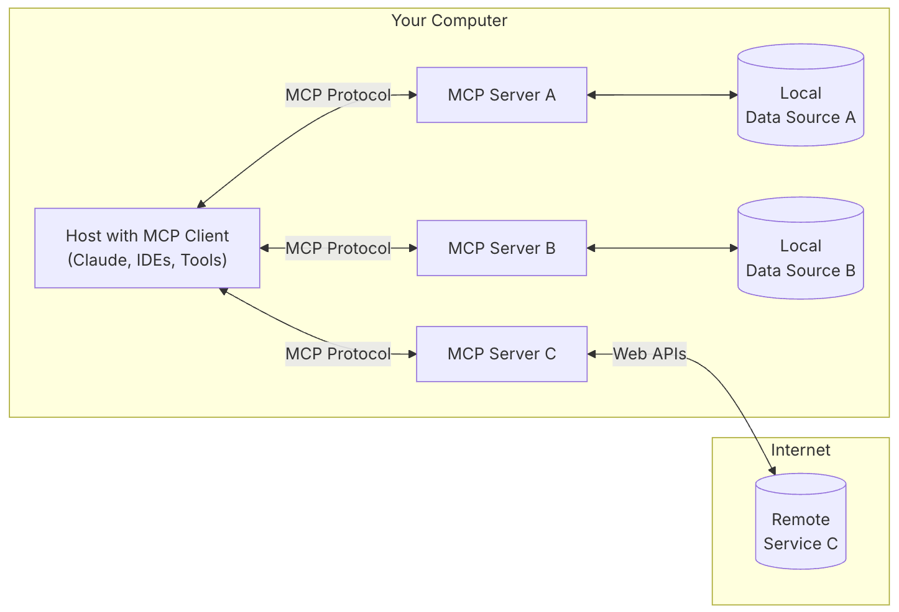

## Introduction

Model Context Protocol (MCP) is an open protocol that standardizes how applications provide context to LLMs. It's a new standard for connecting AI assistants to the systems where data lives, including content repositories, business tools, and development environments. Its aim is to help frontier models produce better, more relevant responses.

## Why MCP?
As AI assistants gain mainstream adoption, the industry has invested heavily in model capabilities, achieving rapid advances in reasoning and quality. Yet even the most sophisticated models are constrained by their isolation from data—trapped behind information silos and legacy systems. Every new data source requires its own custom implementation, making truly connected systems difficult to scale.

MCP addresses this challenge. It provides a universal, open standard for connecting AI systems with data sources, replacing fragmented integrations with a single protocol. The result is a simpler, more reliable way to give AI systems access to the data they need.
​<!-- more -->
## General architecture
MCP enables developers to build secure, two-way connections between their data sources and AI-powered tools. The architecture is straightforward: developers can either expose their data through MCP servers or build AI applications (MCP clients) that connect to these servers.

- **MCP Hosts**: Programs like Claude Desktop, IDEs, or AI tools that want to access data through MCP
- **MCP Clients**: Protocol clients that maintain 1:1 connections with servers
- **MCP Servers**: Lightweight programs that each expose specific capabilities through the standardized Model Context Protocol
- **Local Data Sources**: Your computer’s files, databases, and services that MCP servers can securely access
- **Remote Services**: External systems available over the internet (e.g., through APIs) that MCP servers can connect to
